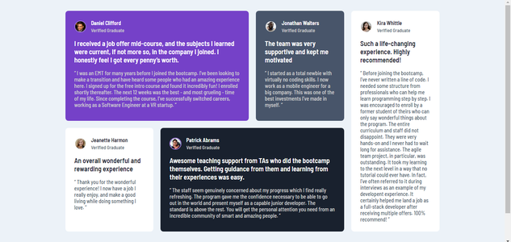

# Frontend Mentor - Testimonials Grid Section

Este projeto é uma solução do desafio [Testimonials grid section](https://www.frontendmentor.io/challenges/testimonials-grid-section-Nnw6J7Un7) do Frontend mentor que é  uma plataforma de desafios que te ajuda a melhorar suas habilidades de codificação e desenvolviemnto através da construção de projetos reais. 

Projeto concluído ✅

## Tabela de conteúdos

- [Visão Geral](#visão-geral)
  - [O desafio](#odesafio)
  - [Screenshots](#screenshots)
  - [Links](#links)
- [Meu processo](#meu-processo)
  - [Tecnologias](#tecnologias)
  - [Fontes](#fontes)
  - [Ferramentas](#ferramentas)
- [Autor](#author)
- [Licença](#licença)

## 💻Visão Geral

### O desafio

O projeto é um página web com seção grid de depoimentos feita usando HTML5 e CSS3.  

No projeto, os usuários são capazes de:

- [x] Visualizar o layout ideal para o site, dependendo do tamanho da tela do dispositivo

### Screenshots

 

### Links

- [Aplicação no Github Pages](https://gustavovictor.me/testimonials-grid-section/)

## 🛠Meu processo

### Tecnologias

- [HTML5](https://developer.mozilla.org/pt-BR/docs/Web/HTML)
    - [Marcação HTML5 semântica](https://developer.mozilla.org/pt-BR/docs/Glossary/Semantics)
- [CSS](https://developer.mozilla.org/pt-BR/docs/Web/CSS)
    - [Flexbox](https://developer.mozilla.org/pt-BR/docs/Learn/CSS/CSS_layout/Flexbox)
    - [Grid](https://developer.mozilla.org/pt-BR/docs/Web/CSS/CSS_Grid_Layout)
    - [Mobile first](https://developer.mozilla.org/en-US/docs/Web/Progressive_web_apps/Responsive/Mobile_first)

### Fontes

- [Barlow Semi Condensed (500, 600)](https://fonts.google.com/specimen/Barlow+Semi+Condensed)

### Ferramentas

- [Visual Studio Code](https://code.visualstudio.com/)

## 🦸‍♂️Autor

- Website - [gustavovictor](http://gustavovictor.me/)
- Frontend Mentor - [@Gustavo-Victor](https://www.frontendmentor.io/profile/Gustavo-Victor)
- CodePen - [@gustavo_victor](https://codepen.io/gustavo_victor)

## 📋Licença

Este projeto está sob a licença [MIT](./LICENSE) 

Qualquer pessoa pode usar e contribuir com este projeto ✌

